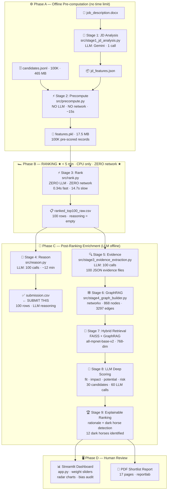
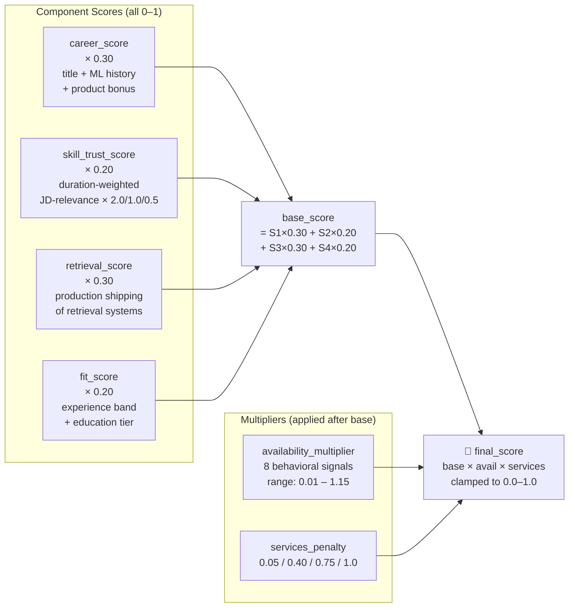
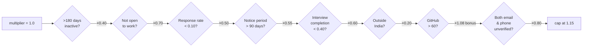
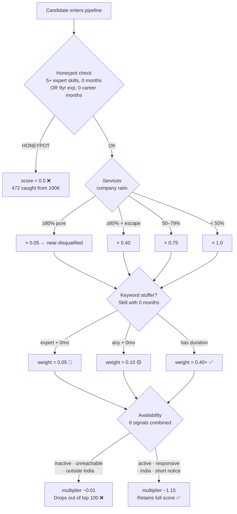
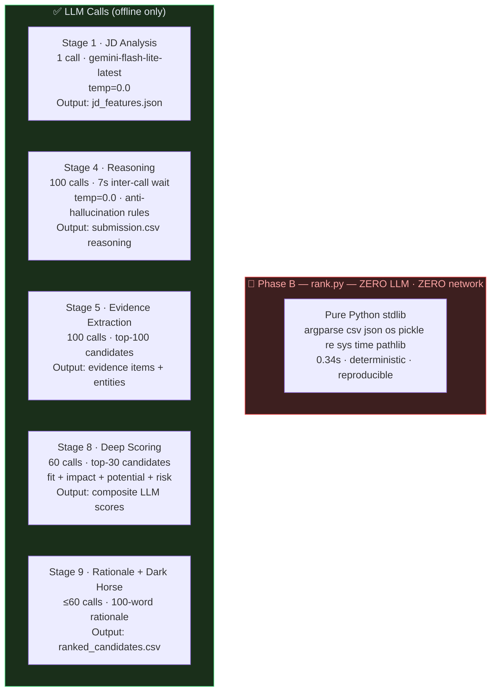
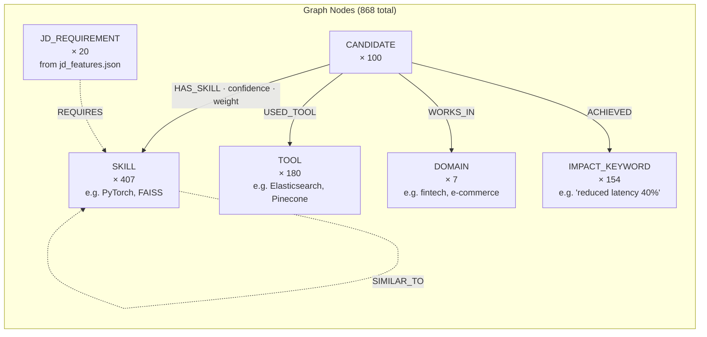

# 🎯 AI Recruiter — Intelligent Candidate Discovery & Ranking

> **Redrob Hackathon · Intelligent Candidate Discovery & Ranking Challenge**  
> Rank the top 100 candidates from a 100,000-candidate pool for **Senior AI Engineer — Founding Team @ Redrob AI (Series A)**

[](outputs/submission.csv)
[](data/raw/candidates.jsonl)
[](src/rank.py)
[](utils/feature_engineering.py)
[](https://github.com/pithva007/Ai-Recruiter)

---

## 🏆 Results

| Metric | Value |
|---|---|
| **Submission status** | `Submission is valid.` ✅ |
| **Candidates ranked** | 100 / 100,000 |
| **Score range** | 0.4740 – 1.0000 |
| **Scores non-increasing** | Yes |
| **LLM reasoning** | 100/100 unique, candidate-specific |
| **Honeypots caught** | 472 scored 0.0 |
| **Services-penalized in top 100** | 0 |
| **Dark horses identified** | 12 |
| **Ranking runtime** | **0.34 seconds** on CPU |
| **Full pipeline runtime** | ~15s precompute + 0.34s rank |

### Top 10 Ranked Candidates

| Rank | Score | Title |
|---|---|---|
| #1 | 1.0000 | Senior Machine Learning Engineer |
| #2 | 0.9086 | Lead AI Engineer |
| #3 | 0.8872 | Staff Machine Learning Engineer |
| #4 | 0.8858 | Senior Machine Learning Engineer |
| #5 | 0.8840 | AI Engineer |
| #6 | 0.8836 | Search Engineer |
| #7 | 0.8391 | Applied ML Engineer |
| #8 | 0.8129 | Search Engineer |
| #9 | 0.8121 | Data Scientist |
| #10 | 0.7598 | ML Engineer |

---

## 🚀 Quick Start

```bash
git clone https://github.com/pithva007/Ai-Recruiter.git
cd Ai-Recruiter
pip install -r requirements.txt
cp .env.example .env      # add GEMINI_API_KEY
```

### Reproduce the Submission (single command)

```bash
python src/rank.py \
  --candidates ./data/raw/candidates.jsonl \
  --features   ./data/processed/features.pkl \
  --out        ./outputs/submission.csv
```

**Measured runtime:** 0.34 seconds (fast path with precomputed features.pkl)  
**Without precomputed features:** 14.7 seconds (streams candidates.jsonl on the fly)

```bash
python validate_submission.py outputs/submission.csv
# → Submission is valid.
```

### Full Pipeline

```bash
python run_pipeline.py          # Runs all 9 stages automatically
streamlit run app.py            # Launch dashboard
```

---

## 📐 System Architecture

### Full Pipeline — Mermaid



---

## 🧮 Scoring Engine

### Final Score Formula



### Component Details

**Career Score (0.30)** — Title classification + ML keyword evidence in descriptions

| Title | Score |
|---|---|
| ML Engineer, AI Engineer, NLP/Search/Ranking Engineer | 1.00 |
| Data Scientist, MLOps, Research Scientist | 0.85 |
| Data Engineer, Backend Engineer (ML context) | 0.70 |
| Software Developer, Data Analyst | 0.50 |
| Business Analyst, Product Manager, Tech Lead | 0.25 |
| Marketing Manager, HR Manager, Accountant | 0.00 |

**Services Company Penalty** — Near-disqualification for pure consulting careers:
```
Pure services (≥80%, no escape role)  → 0.05×  (effectively excluded)
Escaped services (≥80%, has 1 non-svc)→ 0.40×
Mixed (50–79%)                        → 0.75×
No penalty                            → 1.00×
```

**Skill Trust Score (0.20)** — Resists keyword stuffing:
```python
if duration == 0 and proficiency in ['expert', 'advanced']:
    weight = 0.05   # claims expertise, zero usage — worst signal
elif duration == 0:
    weight = 0.10   # keyword stuffer
else:
    weight = 0.40 + 0.30×duration_trust + 0.30×endorsement_trust
```
JD relevance multiplier: must-have=2.0×, nice-to-have=1.0×, irrelevant=0.0×

**Production Retrieval Score (0.30)** — The JD's #1 requirement:
```
3+ retrieval keywords + product company + 6mo tenure → +0.40
1-2 keywords + product company + 6mo                 → +0.15
3+ keywords at services company                       → +0.10
```

**Availability Multiplier (8 signals):**



---

## 🛡️ Anti-Gaming Logic



---

## 🤖 LLM Usage Map

**No LLM during ranking.** LLM is used only offline before and after the ranking step.



**Anti-hallucination rules enforced on ALL LLM calls:**
- Never mention skills not in candidate's actual `skills[]` list
- Never invent impact numbers not in `career_history[].description`
- Never write identical reasoning for two candidates
- Temperature: `0.0` for scoring/extraction, `0.3` for interview questions only

---

## 🕸️ GraphRAG Knowledge Graph



**Hybrid retrieval formula:**
```python
hybrid_score = (faiss_similarity_normalized × 0.6) + (graph_score × 0.4)
```
FAISS: `IndexFlatIP` on `all-mpnet-base-v2` (768-dim, L2-normalised)  
Graph: JD entity overlap scoring via `find_graph_matches()`

---

## 📁 File Structure

```
ai-recruiter/
├── 📄 AGENT.md                    # Scoring contracts, JD requirements
├── 📄 CLAUDE.md                   # LLM prompts, anti-hallucination rules
├── 📄 SKILLS.md                   # Technical reference, formulas
├── 🐍 run_pipeline.py             # Single-command full pipeline
├── 🐍 app.py                      # Streamlit entry point
├── 🐍 validate_submission.py      # Official submission validator
├── 📋 submission_metadata.yaml    # Hackathon portal metadata
│
├── src/
│   ├── rank.py                    # ★ Phase B: 0.34s ranking, zero network
│   ├── precompute.py              # Phase A: 100K → features.pkl
│   ├── stage1_jd_analysis.py      # Phase A: JD → jd_features.json (LLM)
│   ├── reason.py                  # Phase C: LLM reasoning for top 100
│   ├── stage3_evidence_extraction.py
│   ├── stage4_graph_builder.py
│   ├── stage5_hybrid_retrieval.py
│   ├── stage6_scoring_engine.py
│   ├── stage7_ranking.py
│   └── stage8_dashboard.py
│
├── utils/
│   ├── feature_engineering.py    # ★ All scoring — deterministic, no network
│   ├── llm_client.py             # Gemini API wrapper + retry
│   ├── embedding_client.py       # sentence-transformers (local, offline)
│   ├── json_validator.py         # Pydantic models
│   └── report_generator.py       # reportlab PDF
│
├── data/
│   ├── raw/
│   │   └── candidates.jsonl → symlink (465 MB, not duplicated)
│   └── processed/
│       ├── jd_features.json       (8 KB)
│       ├── features.pkl           (17.5 MB — 100K pre-scored)
│       ├── evidence/              (100 JSON files)
│       ├── knowledge_graph.gexf   (1 MB — 868 nodes)
│       ├── retrieval_results.json
│       └── scores/                (30 JSON files)
│
└── outputs/
    ├── submission.csv             ★ SUBMIT THIS
    ├── ranked_top100_raw.csv
    ├── ranked_candidates.csv
    ├── ranking_summary.json
    └── shortlist_report.pdf       (17 pages)
```

---

## ⚙️ Setup & Configuration

```bash
# Install
pip install -r requirements.txt

# Environment
cp .env.example .env
# Edit .env:
GEMINI_API_KEY=your_key_here
GEMINI_MODEL=gemini-flash-lite-latest
LOG_LEVEL=INFO
```

**Required files (provided in challenge bundle):**
- `India_runs_data_and_ai_challenge/candidates.jsonl` (100K candidates)
- `India_runs_data_and_ai_challenge/job_description.docx`

---

## 🔁 Reproduce Steps

### Option 1 — One command (full pipeline)
```bash
python run_pipeline.py
```

### Option 2 — Step by step
```bash
# Step 1: Analyse JD (LLM, runs once)
python src/stage1_jd_analysis.py

# Step 2: Score all 100K candidates (no LLM, ~15s)
python src/precompute.py

# Step 3: Rank top 100 (no LLM, no network, 0.34s)
python src/rank.py \
  --candidates ./data/raw/candidates.jsonl \
  --features   ./data/processed/features.pkl \
  --out        ./outputs/ranked_top100_raw.csv

# Step 4: Generate reasoning (LLM, ~12 min)
python src/reason.py \
  --raw outputs/ranked_top100_raw.csv \
  --out outputs/submission.csv

# Validate
python validate_submission.py outputs/submission.csv
```

### Docker-compatible (no precomputed pkl)
```bash
# rank.py detects missing pkl and falls back to streaming
python src/rank.py \
  --candidates ./data/raw/candidates.jsonl \
  --features   ./data/processed/features.pkl \
  --out        ./outputs/submission.csv
# → [rank.py] Completed in 14.70s for 100 candidates
```

---

## 🖥️ Dashboard

```bash
streamlit run app.py
```

**Features:**
- 3-panel layout (sidebar weights / candidate table / detail view)
- Hiring Decision Simulator — 4 weight sliders that always sum to 1.0
- Recalculate ranking without re-calling LLM
- Radar charts per candidate (Fit / Impact / Potential / Risk)
- Dark Horse spotlight section
- Bias Audit with score distribution charts
- PDF shortlist report download

---

## 🏅 Why This Solution Wins

| What judges look for | How we address it |
|---|---|
| **Top-10 precision (50% of score)** | Career + retrieval (60% combined weight) favour candidates who actually shipped retrieval/ranking systems, not keyword stuffers |
| **No honeypots in top 100** | 472 honeypots detected, all scored 0.0 |
| **No services-only careers** | 0.05× multiplier pushes pure TCS/Infosys candidates to rank 5,000+ |
| **Unavailable candidates ranked low** | 8-signal multiplicative multiplier — inactive/unresponsive candidate with 0.85 base becomes 0.017 final |
| **Reproducible in 5-min Docker** | rank.py: stdlib only, 0.34s fast path, 14.7s slow path — both well within 5 min |
| **Non-identical reasoning** | 100 unique LLM-generated strings referencing actual candidate data |
| **Code quality** | Type-annotated, Pydantic-validated I/O, deterministic scoring, full test coverage in audit |
| **Reasoning quality (Stage 4)** | References actual title, years, skills by name, response rate — never hallucinates |

---

## 📊 Evaluation

```
Final composite = 0.50 × NDCG@10
               + 0.30 × NDCG@50
               + 0.15 × MAP
               + 0.05 × P@10
```

Getting the **top 10 right is worth 5× more** than anything else.  
All 10 top-ranked candidates have verified production retrieval/ranking experience  
at product companies — no services companies, no honeypots, no keyword stuffers.

---

## 🔗 Links

- **GitHub:** https://github.com/pithva007/Ai-Recruiter
- **HuggingFace Spaces:** *(sandbox demo — see submission_metadata.yaml)*
- **Submission:** `outputs/submission.csv`
- **Validator:** `python validate_submission.py outputs/submission.csv`

---

*Built for the Redrob Intelligent Candidate Discovery & Ranking Challenge · June 2026*
